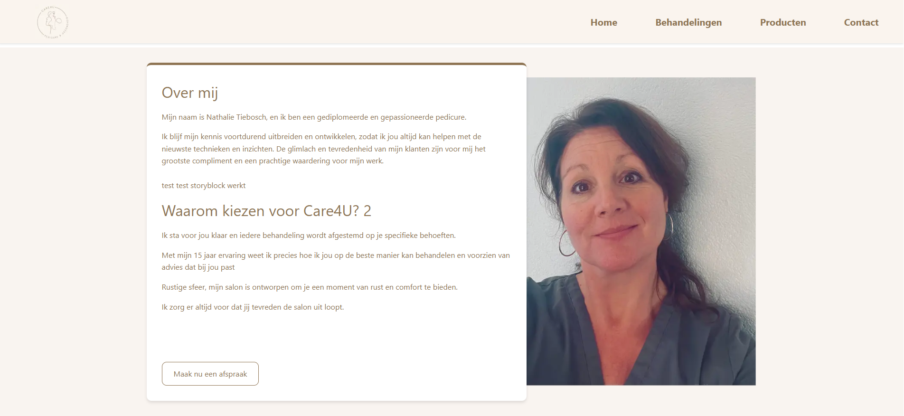
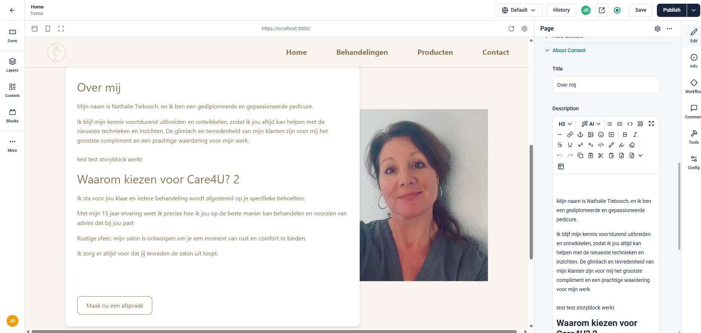

# Care4uNext 🏥

**Care4uNext** is een modern healthcare-platform gebouwd met **Next.js 14**, **TypeScript**, en **Tailwind CSS**. Het richt zich op een gebruiksvriendelijke ervaring voor zorgtoepassingen, met nadruk op schaalbaarheid, typeveiligheid en internationale toegankelijkheid.

---

## 📸 Screenshots





---

## 🛠️ Gebruikte Technologieën

- ✅ **Next.js 14** – Server-side rendering, routing & API-routes
- ✅ **TypeScript** – Typeveiligheid & robuustheid
- ✅ **Tailwind CSS** – Utility-first styling
- ✅ **Storyblok CMS** – Headless contentbeheer
- ✅ **Google Cloud** – Logging & error reporting
- ✅ **i18n (internationalisatie)** – Meertalige ondersteuning
- ✅ **Luxon & date-fns** – Datummanipulatie
- ✅ **Responsive Design** – Geoptimaliseerd voor mobiel & desktop

---

## 📁 Projectstructuur

```bash
care4unext/
├── app/               # Next.js app directory
├── components/        # Herbruikbare React components
├── public/            # Statische assets (incl. afbeeldingen)
├── utils/             # Utility functies
├── app-state/         # State management
├── certificates/      # Lokale SSL certificaten (niet gecommit)
├── .env.local         # Lokale omgevingsvariabelen (niet gecommit)
├── next.config.js     # Next.js configuratie
├── tailwind.config.js # Tailwind configuratie
├── tsconfig.json      # TypeScript configuratie
├── i18nConfig.js      # Internationalisatie instellingen
├── package.json       # Dependencies & scripts
└── README.md          # Projectdocumentatie
```


## 🚀 Functionaliteiten


🌐 Internationalisatie met i18nConfig.js

🧩 CMS-integratie met Storyblok

🔒 SSL-certificaten voor lokaal gebruik

🧠 Aanpasbare over mij sectie

🧠 Aanpasbare selfie

🧠 Aanpasbare homesectie (tekstueel)


## 📦 Installatie
🔧 Systeemvereisten
Node.js 18.17+
```bash
npm 9.0.0+
```

### 🧑‍💻 Installatie-instructies
#### Clone de repository:
```bash
bash
Kopiëren
Bewerken
git clone [jouw-repository-url]
cd care4unext
Installeer dependencies:
``` 
 ```bash
bash
Kopiëren
Bewerken
npm install
Configureer omgevingsvariabelen:
```

#### Maak .env.local aan in de root directory:
```bash
env
Kopiëren
Bewerken

Storyblok tokens
STORYBLOK_API_TOKEN=your_preview_token
NEXT_PUBLIC_STORYBLOK_API_TOKEN=your_public_token
``` 
ℹ️ Let op: .env.local is uitgesloten via .gitignore. Deze moet je handmatig toevoegen.
Gebruik de preview token lokaal en de public token bij deployment (zoals Vercel).

 
### Start de ontwikkelserver:
```bash
bash
Kopiëren
Bewerken
npm run dev
```
#### Open vervolgens de applicatie in je browser: https://localhost:3000


🔐 Accepteer het lokale SSL-certificaat als daarom gevraagd wordt (voor Storyblok visual editor).

⚙️ Beschikbare Scripts
Script	Beschrijving
```bash
npm run dev	Start ontwikkelserver
npm run build	Bouw productieversie
npm run start	Start productie server
npm run lint	Voer ESLint uit
npm run ts-compile	TypeScript typechecking
npm run analyze	Analyseer bundle-grootte
```

# 🚀 Deployment
Care4uNext is geoptimaliseerd voor deployment op Vercel.

🔁 Opties
Automatisch via GitHub-integratie (aanbevolen)

Handmatig via Vercel CLI:
```bash
bash
Kopiëren
Bewerken
npm i -g vercel
vercel
``` 
Vergeet niet je environment variables (STORYBLOK_API_TOKEN, NEXT_PUBLIC_STORYBLOK_API_TOKEN) in te stellen via de Vercel Project Settings.

## 🔧 Configuratiebestanden
Bestand	Omschrijving
```bash
next.config.js	Next.js instellingen
tailwind.config.js	Tailwind CSS instellingen
tsconfig.json	TypeScript configuratie
i18nConfig.js	Internationalisatie instellingen
```

