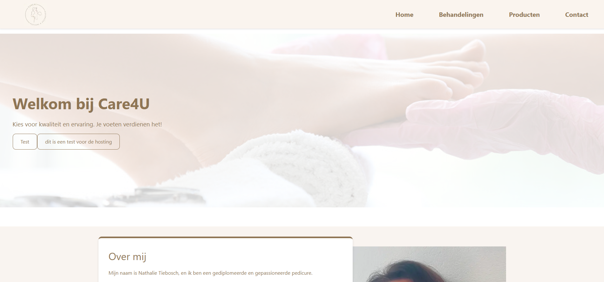

Care4uNext 🏥
Care4uNext is een modern healthcare platform, gebouwd met Next.js, TypeScript, en Tailwind CSS. Dit platform richt zich op het bieden van een gebruiksvriendelijke ervaring voor zorggerelateerde toepassingen, met focus op schaalbaarheid, typeveiligheid en internationale toegankelijkheid.

Foto

🛠️ Gebruikte Technologieën
📂 Projectstructuur
Hieronder vind je de mappenstructuur van het project:

Bash

care4unext/
├── app/               # Next.js app directory
├── components/        # Herbruikbare React components
├── public/            # Statische assets
├── utils/             # Utility functies
├── app-state/         # Applicatie state management
├── certificates/      # Lokale SSL certificaten (niet gecommit)
├── .env.local         # Lokale omgevingsvariabelen (niet gecommit)
├── next.config.js     # Next.js configuratie
├── tailwind.config.js # Tailwind CSS configuratie
├── tsconfig.json      # TypeScript configuratie
├── i18nConfig.js      # Internationalisatie configuratie
├── package.json       # Dependencies en scripts
└── README.md          # Documentatie
🚀 Functionaliteiten
Kernfunctionaliteiten:
Modern React met Next.js 14: Profiteert van de nieuwste Next.js-features voor server-side rendering, routing en API-routes.
TypeScript voor type veiligheid: Zorgt voor robuuste code en betere ontwikkelervaring door statische typering.
Tailwind CSS voor styling: Maakt snelle en responsieve UI-ontwikkeling mogelijk met utility-first CSS.
Internationalisatie ondersteuning (i18n): Klaar voor meertalige content met i18nConfig.js.
Storyblok CMS integratie: Flexibel contentbeheer via een headless CMS.
Google Cloud integratie: Voor geavanceerde logging en error reporting.
Progress bar: Verbetert de gebruikerservaring tijdens het laden van pagina's.
Datum verwerking: Efficiënte datummanipulatie met date-fns en Luxon.
Responsive design: Geoptimaliseerd voor diverse schermgroottes, van mobiel tot desktop.
📦 Installatie
Systeem Vereisten
Node.js 18.17 of hoger
npm 9.0.0 of hoger
Installatie-instructies
Clone de repository:

Bash

git clone [jouw-repository-url]
cd care4unext
Installeer dependencies:

Bash

npm install
Configureer Omgevingsvariabelen:
Maak een bestand genaamd .env.local aan in de root directory en voeg je Storyblok API tokens toe:

Codefragment

# Storyblok tokens
STORYBLOK_API_TOKEN=your_preview_token
NEXT_PUBLIC_STORYBLOK_API_TOKEN=your_public_token
Belangrijke Notities:

npm run dev geeft je een lokaal SSL-certificaat voor localhost. Sta dit alstublieft toe. Dit is nodig voor de visuele live editor van Storyblok.
Er is geen .env.local of .env in deze repository, omdat ze in .gitignore staan. Je moet ze zelf aanmaken en de access tokens toevoegen.
Gebruik de preview token voor .env.local (voor lokale ontwikkeling).
Gebruik de public token voor .env bij deployment (bijvoorbeeld op Vercel, configureer dit in de Vercel project settings).
Start de ontwikkelserver:

Bash

npm run dev
Open de applicatie in je browser op https://localhost:3000.

⚙️ Beschikbare Scripts
npm run dev - Start development server
npm run build - Build voor productie
npm run start - Start productie server
npm run lint - Run ESLint
npm run ts-compile - TypeScript type checking
npm run analyze - Analyseer bundle grootte
🚀 Deployment
Dit project is geconfigureerd voor deployment op Vercel. De deployment kan worden uitgevoerd via:

GitHub integratie met Vercel (aanbevolen voor geautomatiseerde deployments).
Vercel CLI:
Bash

npm i -g vercel
vercel
Zorg ervoor dat je de juiste environment variables hebt geconfigureerd in je Vercel project settings (bijv. STORYBLOK_API_TOKEN, NEXT_PUBLIC_STORYBLOK_API_TOKEN).
🔧 Configuratiebestanden
Het project maakt gebruik van de volgende configuratiebestanden:

next.config.js - Next.js configuratie
tailwind.config.js - Tailwind CSS configuratie
tsconfig.json - TypeScript configuratie
i18nConfig.js - Internationalisatie configuratie
✨ Bijdragen
Voel je vrij om bij te dragen aan dit project! Open een pull request of rapporteer een issue.

📄 Licentie
Dit project valt onder de MIT-licentie.